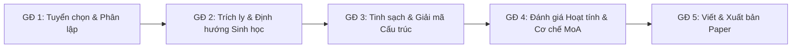

# SYLLABUS NGHIÊN CỨU KHOA HỌC & HỆ THỐNG SCIENTIFIC RAG AGENT

Tài liệu hướng dẫn toàn diện dành cho Researcher:
1. **Syllabus Nghiên cứu Khoa học**: Từ phân lập vi khuẩn $\rightarrow$ Sàng lọc & Chiết xuất hợp chất $\rightarrow$ Giải cấu trúc $\rightarrow$ Cơ chế kháng ung thư $\rightarrow$ Xuất bản bài báo ISI/Scopus (Q1/Q2).
2. **Kiến trúc Codebase Python**: Hệ thống RAG (Hybrid Search) & Bộ công cụ Agent (PubMed, PubChem, RDKit Lipinski).

---

## PHẦN 1: SYLLABUS NGHIÊN CỨU KHOA HỌC (SPECIALIZED IN PAPER WRITING)

Mục tiêu: Đạt chuẩn công bố trên các tạp chí chuyên ngành uy tín (*Journal of Natural Products, ACS Chemical Biology, European Journal of Medicinal Chemistry, Bioorganic Chemistry, Frontiers in Microbiology*).



---

### GIAI ĐOẠN 1: TUYỂN CHỌN CHỦNG & SINH TỔNG HỢP (BIOPROSPECTING)
*Thời lượng dự kiến: 1 – 2 tháng | Output: Dữ liệu định danh & profile lên men*

- **1.1. Lựa chọn nguồn sinh thái đặc thù**:
  - Vi khuẩn nội sinh (*Endophytic bacteria*), xạ khuẩn (*Actinobacteria / Streptomyces*), vi khuẩn biển (*Marine bacteria*) hoặc vi sinh vật chịu mặn/nhiệt.
- **1.2. Định danh chủng vi sinh**:
  - Tách chiết DNA, PCR khuếch đại và giải trình tự gen 16S rRNA (Sanger sequencing).
  - Dựng cây phát sinh loài (Phylogenetic tree bằng MEGA hoặc IQ-TREE).
  - *(Điểm cộng cho bài báo Q1)*: Whole Genome Sequencing (WGS) + Khai phá cụm gen sinh tổng hợp (Biosynthetic Gene Clusters - BGCs) bằng antiSMASH.
- **1.3. Tối ưu hóa điều kiện biểu hiện chuyển hóa (OSMAC approach)**:
  - Áp dụng chiến lược *One Strain Many Compounds* (thay đổi nguồn carbon, nitrogen, pH, nhiệt độ, độ mặn, bổ sung epigenetic modifiers) để kích hoạt các cụm gen "câm" (*silent BGCs*).

---

### GIAI ĐOẠN 2: CHIẾT XUẤT, SÀNG LỌC & DEREPLICATION
*Thời lượng dự kiến: 1.5 – 2 tháng | Output: Bioassay data & GNPS molecular networks*

- **2.1. Quy trình chiết xuất**:
  - Lên men quy mô phòng thí nghiệm (5L – 20L), chiết pha lỏng-lỏng (EtOAc, n-BuOH, DCM) hoặc sử dụng nhựa hấp phụ (Diaion HP-20, Amberlite XAD-16).
- **2.2. Phân đoạn định hướng sinh học (Bioassay-guided fractionation)**:
  - Thử nghiệm độc tính tế bào sơ bộ (MTT / CCK-8 / SRB assay) trên panel dòng tế bào ung thư người: HeLa (cổ tử cung), MCF-7 (vú), HepG2 (gan), A549 (phổi).
  - Đánh giá song song trên tế bào lành (HEK-293, Vero) để xác định chỉ số chọn lọc (*Selectivity Index - SI*).
- **2.3. Loại trừ chất đã biết (Dereplication)**:
  - Phân tích LC-MS/MS kết hợp mạng lưới phân tử **GNPS (Global Natural Products Social Molecular Networking)**.
  - Đối chiếu thư viện (Dictionary of Natural Products, MarinLit, AntiBase) để phát hiện sớm các ion phân tử là dẫn xuất mới, tránh lãng phí thời gian tinh sạch lại chất cũ.

---

### GIAI ĐOẠN 3: PHÂN LẬP & XÁC ĐỊNH CẤU TRÚC HÓA HỌC (STRUCTURAL ELUCIDATION)
*Thời lượng dự kiến: 2 – 3 tháng | Output: Bộ dữ liệu phổ NMR, HR-MS, cấu hình lập thể*

- **3.1. Tinh sạch hợp chất mục tiêu**:
  - Sắc ký cột chân không (VLC), sắc ký gel permeation (Sephadex LH-20), và Semi-preparative / Preparative HPLC (C18 reverse-phase column).
- **3.2. Giải mã cấu trúc phẳng**:
  - Khối phổ phân giải cao: HR-ESI-MS (xác định công thức phân tử chính xác với sai số $\Delta < 5\text{ ppm}$).
  - Đo phổ NMR 1D & 2D (500 – 800 MHz trong dung môi deuterated phù hợp): $^1\text{H}$, $^{13}\text{C}$, DEPT, $^1\text{H}-^1\text{H}$ COSY, HSQC, HMBC.
- **3.3. Xác định cấu hình lập thể (Stereochemistry)**:
  - Cấu hình tương đối: Phổ NOESY / ROESY, phân tích hằng số ghép cặp ($J$-coupling values).
  - Cấu hình tuyệt đối: Phổ lưỡng sắc tròn điện tử (ECD) so sánh với mô phỏng phiếm hàm mật độ (DFT-ECD calculation), hoặc tinh thể học tia X (Single-crystal X-ray crystallography) nếu tạo được tinh thể đơn.

---

### GIAI ĐOẠN 4: ĐÁNH GIÁ ĐỘC TÍNH TẾ BÀO & CƠ CHẾ PHÂN TỬ (MECHANISM OF ACTION - MoA)
*Thời lượng dự kiến: 2 tháng | Output: Cơ chế apoptosis/cell cycle arrest, Western blot, docking*

- **4.1. Định lượng độc tính tế bào chuyên sâu**:
  - Xác định giá trị $\text{IC}_{50}$ qua 24h, 48h, 72h đối chứng với thuốc chuẩn lâm sàng (Doxorubicin, Cisplatin, Paclitaxel).
- **4.2. Khảo sát cơ chế chết tế bào**:
  - **Dừng chu kỳ tế bào (Cell Cycle Arrest)**: Nhuộm Propidium Iodide (PI) phân tích bằng Flow Cytometry (xem bắt giữ ở pha G0/G1, S, hay G2/M).
  - **Apoptosis Assay**: Nhuộm kép Annexin V-FITC / PI đánh giá tỷ lệ apoptosis sớm và muộn.
  - **Đo chức năng ty thể & stress oxy hóa**: Thế màng ty thể ($\Delta\Psi_m$ qua nhuộm JC-1), mức ROS nội bào (DCFH-DA assay).
- **4.3. Sinh học phân tử (Western Blot / RT-qPCR)**:
  - Khảo sát các protein chỉ thị: Cleaved Caspase-3, Caspase-9, PARP, tỷ lệ Bax/Bcl-2, p53, hoặc các trục truyền tín hiệu tăng sinh (PI3K/Akt/mTOR, MAPK/ERK).
- **4.4. Đánh giá in silico (Molecular Docking & MD Simulation)**:
  - Docking phân tử hợp chất lên các protein đích tiềm năng (Tubulin, Topoisomerase I/II, EGFR, VEGFR2) kết hợp mô phỏng động lực học phân tử (MD 50–100 ns).

---

### GIAI ĐOẠN 5: CHIẾN LƯỢC VIẾT & XUẤT BẢN BÀI BÁO QUỐC TẾ
*Thời lượng dự kiến: 1 tháng*

- **Cấu trúc chuẩn một bài báo Q1**:
  - **Title**: Chứa nhóm cấu trúc hóa học + chủng vi sinh + đích tác động (Ví dụ: *"Cytotoxic Polyketides from Marine-Derived Streptomyces sp. Induce Apoptosis via PI3K/Akt Pathway"*).
  - **Introduction**: Đi từ thực trạng ung thư kháng thuốc $\rightarrow$ Tiềm năng của vi sinh vật biển/nội sinh $\rightarrow$ Khoảng trống nghiên cứu $\rightarrow$ Mục tiêu công trình.
  - **Results & Discussion**: Logic liền mạch: Phân lập $\rightarrow$ Biện giải cấu trúc (kèm bảng số liệu NMR chi tiết và sơ đồ tương quan 2D) $\rightarrow$ Khảo sát hoạt tính $\rightarrow$ Cơ chế tác động sinh học phân tử.
  - **Supporting Information (SI)**: Chuẩn bị kỹ lưỡng toàn bộ phổ gốc ($^1\text{H}, ^{13}\text{C}$, HSQC, HMBC, HRMS), cây phát sinh loài, HPLC chromatogram chứng minh độ tinh khiết $> 95\%$.

---

## PHẦN 2: THIẾT KẾ CODEBASE PYTHON CHO HỆ THỐNG RAG & AI AGENT TOOLS

### 1. Kiến trúc Thư mục Chuẩn (Project Layout)

```text
scientific_rag_agent/
│
├── data/
│   ├── raw_papers/               # Chứa file PDF bài báo khoa học (.pdf)
│   ├── vector_db/                # Dữ liệu vector nhúng lưu trữ cục bộ
│   └── lab_compounds.csv         # Dữ liệu hoạt tính phân đoạn/hợp chất phòng lab
│
├── src/
│   ├── __init__.py
│   ├── config.py                 # Thiết lập API keys, models, đường dẫn
│   │
│   ├── ingestion/                # Module nạp và xử lý tài liệu
│   │   ├── __init__.py
│   │   ├── pdf_parser.py         # Trích xuất text, bảng, metadata từ PDF
│   │   └── text_splitter.py      # Semantic chunking theo Section (Intro, Methods...)
│   │
│   ├── rag/                      # Lõi truy vấn RAG
│   │   ├── __init__.py
│   │   ├── embeddings.py         # Dense embeddings (BGE / SciBERT / OpenAI)
│   │   ├── vector_store.py       # ChromaDB / Qdrant interface
│   │   └── retriever.py          # Hybrid search: BM25 + Vector + Re-ranking
│   │
│   ├── tools/                    # Các Tools cho AI Agent gọi
│   │   ├── __init__.py
│   │   ├── pubmed_tool.py        # Tìm kiếm & đọc abstract từ PubMed API
│   │   ├── pubchem_tool.py       # Tra cứu CID, công thức, cấu trúc từ PubChem
│   │   ├── rdkit_tool.py         # Tính chất hóa lý (MW, LogP, Lipinski Rule of 5)
│   │   └── lab_data_tool.py      # Truy vấn dữ liệu thử nghiệm của lab
│   │
│   └── agent/                    # Lõi Agent điều phối
│       ├── __init__.py
│       ├── prompts.py            # System prompts định hướng khoa học
│       └── agent_runner.py       # ReAct Loop / Tool Execution Engine
│
├── requirements.txt
└── main.py                       # CLI/Giao diện chính để tương tác
```

---

### 2. Thiết lập Phụ thuộc (`requirements.txt`)

```text
pydantic>=2.0
langchain-core>=0.2.0
langchain-community>=0.2.0
chromadb>=0.4.24
sentence-transformers>=2.5.0
pypdf>=4.0.0
rdkit>=2023.9.5
requests>=2.31.0
rank_bm25>=0.2.2
```

---

### 3. Cài đặt Chi tiết Mã nguồn

#### A. Tools Nghiên cứu Khoa học (`src/tools/scientific_tools.py`)

```python
"""src/tools/scientific_tools.py: Bộ công cụ chuyên dụng cho AI Nghiên cứu."""

import json
import requests
from typing import Dict, Any
from rdkit import Chem
from rdkit.Chem import Descriptors, Lipinski

def query_pubmed(query: str, max_results: int = 3) -> str:
    """
    Tra cứu tài liệu y sinh trên cơ sở dữ liệu NCBI PubMed.
    Trả về danh sách tiêu đề, PMID và trích dẫn.
    """
    base_esearch = "https://eutils.ncbi.nlm.nih.gov/entrez/eutils/esearch.fcgi"
    base_esummary = "https://eutils.ncbi.nlm.nih.gov/entrez/eutils/esummary.fcgi"
    
    # 1. Tìm kiếm ID
    search_params = {
        "db": "pubmed",
        "term": query,
        "retmode": "json",
        "retmax": max_results
    }
    r = requests.get(base_esearch, params=search_params, timeout=10)
    id_list = r.json().get("esearchresult", {}).get("idlist", [])
    if not id_list:
        return f"Không tìm thấy bài báo nào trên PubMed với từ khóa: '{query}'"
    
    # 2. Lấy thông tin tóm tắt
    sum_params = {
        "db": "pubmed",
        "id": ",".join(id_list),
        "retmode": "json"
    }
    r_sum = requests.get(base_esummary, params=sum_params, timeout=10)
    result = r_sum.json().get("result", {})
    
    articles = []
    for pmid in id_list:
        info = result.get(pmid, {})
        title = info.get("title", "N/A")
        pubdate = info.get("pubdate", "N/A")
        source = info.get("source", "N/A")
        articles.append(f"- [PMID: {pmid}] {title} ({source}, {pubdate})")
        
    return "\n".join(articles)


def query_pubchem(compound_name: str) -> str:
    """
    Tra cứu hợp chất hóa học trên PubChem bằng tên.
    Trả về PubChem CID, SMILES, và Khối lượng phân tử.
    """
    url = f"https://pubchem.ncbi.nlm.nih.gov/rest/pug/compound/name/{compound_name}/JSON"
    resp = requests.get(url, timeout=10)
    if resp.status_code != 200:
        return f"Không tìm thấy hợp chất '{compound_name}' trên PubChem."
    
    data = resp.json()
    try:
        props = data['PC_Compounds'][0]
        cid = props['id']['id']['cid']
        
        smiles = "N/A"
        mw = "N/A"
        for prop in props.get('props', []):
            label = prop.get('urn', {}).get('label', '')
            name = prop.get('urn', {}).get('name', '')
            if label == 'SMILES' and name == 'Canonical':
                smiles = prop.get('value', {}).get('sval', 'N/A')
            elif label == 'Molecular Weight':
                mw = prop.get('value', {}).get('sval', 'N/A')
                
        return json.dumps({
            "compound": compound_name,
            "pubchem_cid": cid,
            "canonical_smiles": smiles,
            "molecular_weight": mw
        }, indent=2)
    except Exception as e:
        return f"Lỗi phân tích dữ liệu PubChem: {str(e)}"


def calculate_druglikeness(smiles: str) -> str:
    """
    Tính toán quy tắc 5 Lipinski (Rule of 5) và các thông số hóa lý dựa trên mã Canonical SMILES.
    """
    mol = Chem.MolFromSmiles(smiles)
    if not mol:
        return "Mã SMILES không hợp lệ."
    
    mw = Descriptors.MolWt(mol)
    logp = Descriptors.MolLogP(mol)
    hbd = Lipinski.NumHDonors(mol)
    hba = Lipinski.NumHAcceptors(mol)
    rotatable_bonds = Descriptors.NumRotatableBonds(mol)
    
    violations = 0
    if mw > 500: violations += 1
    if logp > 5: violations += 1
    if hbd > 5: violations += 1
    if hba > 10: violations += 1
    
    return json.dumps({
        "molecular_weight": round(mw, 2),
        "logP": round(logp, 2),
        "hydrogen_bond_donors": hbd,
        "hydrogen_bond_acceptors": hba,
        "rotatable_bonds": rotatable_bonds,
        "lipinski_violations": violations,
        "drug_like": violations <= 1
    }, indent=2)
```

---

#### B. Trình Lập chỉ mục & Hybrid RAG (`src/rag/engine.py`)

```python
"""src/rag/engine.py: Động cơ RAG kết nối ChromaDB."""

from typing import List, Dict, Any
import chromadb
from chromadb.utils import embedding_functions

class ScientificRAGEngine:
    def __init__(self, collection_name: str = "cancer_bacteria_papers"):
        self.chroma_client = chromadb.PersistentClient(path="./data/vector_db")
        
        # Mô hình embedding nhẹ và hiệu năng cao
        self.emb_fn = embedding_functions.SentenceTransformerEmbeddingFunction(
            model_name="all-MiniLM-L6-v2"
        )
        self.collection = self.chroma_client.get_or_create_collection(
            name=collection_name,
            embedding_function=self.emb_fn
        )

    def add_paper_chunks(self, chunks: List[str], metadatas: List[Dict[str, Any]], ids: List[str]):
        """Thêm các đoạn văn bản trích xuất từ papers vào cơ sở dữ liệu vector."""
        self.collection.add(
            documents=chunks,
            metadatas=metadatas,
            ids=ids
        )

    def query(self, query_text: str, n_results: int = 3) -> str:
        """Truy xuất các đoạn văn bản liên quan nhất."""
        results = self.collection.query(
            query_texts=[query_text],
            n_results=n_results
        )
        
        docs = results.get("documents", [[]])[0]
        metas = results.get("metadatas", [[]])[0]
        
        if not docs:
            return "Không tìm thấy tài liệu liên quan trong thư viện nội bộ."
            
        formatted_context = []
        for i, (doc, meta) in enumerate(zip(docs, metas)):
            source = meta.get("source", "Unknown")
            section = meta.get("section", "General")
            formatted_context.append(f"[{i+1}] (Nguồn: {source} | Mục: {section}):\n{doc}")
            
        return "\n\n".join(formatted_context)
```

---

#### C. Định nghĩa Schema Công cụ cho AI Agent (`src/agent/tool_definitions.py`)

```python
"""src/agent/tool_definitions.py: Tool Schemas cho Function Calling."""

TOOLS_DEFINITION = [
    {
        "name": "query_pubmed",
        "description": "Tra cứu các bài báo nghiên cứu y sinh học và hóa dược trên PubMed.",
        "parameters": {
            "type": "object",
            "properties": {
                "query": {
                    "type": "string",
                    "description": "Từ khóa tìm kiếm (ví dụ: 'Streptomyces anticancer apoptosis HeLa')"
                },
                "max_results": {
                    "type": "integer",
                    "description": "Số lượng kết quả cần lấy (mặc định 3)"
                }
            },
            "required": ["query"]
        }
    },
    {
        "name": "query_pubchem",
        "description": "Tra cứu thông tin cấu trúc hóa học, số CID, SMILES từ tên chất trên PubChem.",
        "parameters": {
            "type": "object",
            "properties": {
                "compound_name": {
                    "type": "string",
                    "description": "Tên hợp chất hóa học (ví dụ: 'Paclitaxel')"
                }
            },
            "required": ["compound_name"]
        }
    },
    {
        "name": "calculate_druglikeness",
        "description": "Tính toán chỉ số tương đồng thuốc (Lipinski Rule of 5, LogP, MW) từ chuỗi SMILES.",
        "parameters": {
            "type": "object",
            "properties": {
                "smiles": {
                    "type": "string",
                    "description": "Chuỗi Canonical SMILES của phân tử"
                }
            },
            "required": ["smiles"]
        }
    },
    {
        "name": "query_internal_rag",
        "description": "Tra cứu các tài liệu, bài báo, ghi chép thí nghiệm đã được nạp vào hệ thống RAG nội bộ.",
        "parameters": {
            "type": "object",
            "properties": {
                "query_text": {
                    "type": "string",
                    "description": "Câu hỏi hoặc nội dung cần tra cứu trong kho tài liệu nội bộ"
                }
            },
            "required": ["query_text"]
        }
    }
]
```

---

#### D. Vòng lặp Khởi chạy & Tương tác (`main.py`)

```python
"""main.py: Điểm khởi chạy của Hệ thống AI Nghiên cứu."""

from src.tools.scientific_tools import query_pubmed, query_pubchem, calculate_druglikeness
from src.rag.engine import ScientificRAGEngine

TOOL_REGISTRY = {
    "query_pubmed": query_pubmed,
    "query_pubchem": query_pubchem,
    "calculate_druglikeness": calculate_druglikeness,
}

def execute_tool(tool_name: str, arguments: dict):
    if tool_name in TOOL_REGISTRY:
        return TOOL_REGISTRY[tool_name](**arguments)
    elif tool_name == "query_internal_rag":
        rag = ScientificRAGEngine()
        return rag.query(**arguments)
    else:
        return f"Tool '{tool_name}' không tồn tại."

if __name__ == "__main__":
    print("=== HỆ THỐNG TRỢ LÝ AI NGHIÊN CỨU DƯỢC LIỆU VI SINH ===")
    
    print("\n1. Demo Tool PubChem:")
    print(execute_tool("query_pubchem", {"compound_name": "Staurosporine"}))
    
    print("\n2. Demo Tool Lipinski (Druglikeness):")
    stauro_smiles = "CC1C2NC(=O)C3=C2C(=C4C=CC=CC4=C3)C5=C1C6=C(C=CC=C6)N5C"
    print(execute_tool("calculate_druglikeness", {"smiles": stauro_smiles}))
    
    print("\n3. Demo Tool PubMed:")
    print(execute_tool("query_pubmed", {"query": "Streptomyces anticancer apoptosis HeLa", "max_results": 2}))
```
